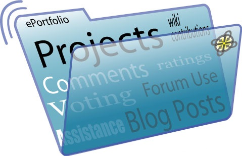

# Farrik Barnard SNHU CS 499 ePortfolio

## Professional Self-Assessment
Throughout my journey in the Computer Science program, the coursework and development of my ePortfolio have significantly shaped my skills, professional goals, and values. This experience has not only showcased my strengths but has also prepared me to enter the computer science field with confidence and a competitive edge.
Completing various projects and assignments has allowed me to demonstrate my technical expertise and problem-solving abilities. For example, implementing secure communication protocols and conducting vulnerability assessments in my capstone project for Artemis Financial highlighted my proficiency in software security. This experience emphasized the importance of secure coding practices, which is crucial for protecting sensitive data and maintaining system integrity.
Collaborating in a team environment has been a vital aspect of my growth. Working on group projects taught me the value of effective communication and teamwork. I learned to coordinate with team members, divide tasks based on individual strengths, and collectively work towards a common goal. This collaborative experience is essential for thriving in a professional setting where teamwork and communication are key.
Communicating with stakeholders is another critical skill I developed. Through presentations and project updates, I learned to convey complex technical information in a clear and concise manner. This ability to bridge the gap between technical and non-technical stakeholders ensures that project goals are understood and met effectively.
My coursework in data structures and algorithms provided a strong foundation in optimizing code for efficiency and performance. Understanding various data structures, such as linked lists, trees, and hash tables, enabled me to solve complex problems efficiently. Mastering algorithms, including sorting, searching, and graph traversal, has been instrumental in developing robust and efficient software solutions.

In software engineering and database management, I gained hands-on experience in designing and developing applications. Learning about different software development methodologies, such as Agile and Waterfall, equipped me with the skills to manage projects effectively. Working with databases, I honed my ability to design efficient database schemas, write complex SQL queries, and ensure data integrity.
Security has been a focal point throughout my education. Implementing encryption, conducting penetration testing, and performing regular security audits have been crucial in ensuring the robustness of my applications. This focus on security prepares me to develop applications that are resilient to threats and comply with industry standards.
My ePortfolio showcases artifacts that demonstrate these skills and competencies. For instance, the secure communication project highlights my ability to implement encryption and ensure data integrity. The vulnerability assessment report exemplifies my skills in identifying and mitigating security risks. These artifacts collectively illustrate my proficiency in various areas of computer science and how they contribute to building secure, reliable, and efficient software solutions.
In summary, my professional self-assessment reflects a comprehensive skill set in computer science, emphasizing secure coding practices, teamwork, effective communication, and technical proficiency. These competencies, showcased through my ePortfolio, set me apart as a qualified and capable professional ready to contribute to the field of computer science.

## Code Review
The following Code Review will address the folowing:
Existing functionality: Provide a detailed walkthrough focused on the features and functionality of the existing code (before enhancements).
Code Analysis: Target areas for improvement such as structure, logic, efficiency, functionality, security, testing, commenting, and documenting.
Enhancement: Provide a walkthrough of planned enhancements that address issues raised in the code analysis. Highlight the specific skills you will demonstrate and address the alignment for each of the five course outcomes across the three categories.

[Code Review Link](https://www.youtube.com/watch?v=XGd-xtpUffI)

## Artifacts

### [SoftwareDesign & Engineering](https://github.com/fbarnard1228/fbarnard1228.github.io/tree/main/Software%20Engineering%20and%20Design)
The artifact is a Contact class. Contact ID, first and last names, phone number, and address are among the variables it contains. Constructors for initializing these variables and methods for validating, obtaining, and setting their values are also included in the class. In order to ensure safe and effective processing of contact information, this artifact was made as part of a software project. This was created to use validation checks and particular exceptions to guarantee data integrity and appropriate error handling.
Because the Contact class captures many essential elements of software development, such as object-oriented programming, data validation, error handling, and acceptable coding techniques, I chose it as an asset for my ePortfolio. Managing contact information is a typical requirement in many software projects, and it is a real implementation of these notions.

### [Algorithms & DataStructure](https://github.com/fbarnard1228/fbarnard1228.github.io/tree/main/Algorithms%20and%20Data%20Structures)
The provided code defines an AnimalShelter class designed to manage CRUD (Create, Read, Update, Delete) operations for an animal collection in MongoDB. The class initializes a connection to a MongoDB database using the provided connection variables and includes methods to create, read, update, and delete animal records in the database. A dashboard for data visualization made with JupyterDash, a framework that combines Dash and Jupyter notebooks, is the artifact. A MongoDB database's contents are shown on the dashboard, which also includes interactive charts, maps, and data tables. This artifact was first produced as a class assignment to showcase abilities in Python web programming, data visualization, and data manipulation.
This artifact was chosen for my ePortfolio because it demonstrates my proficiency with data structures and algorithms, as well as my capacity to create dynamic and eye-catching web software. utilizing Python and Pandas to efficiently retrieve and process data from a MongoDB database. Using algorithms for data handling and visualization, including data aggregation, sorting, and filtering. making maps and interactive infographics that are easy to use. Putting strong error handling in place to guarantee the application functions properly is good practice.

### [Databases](https://github.com/fbarnard1228/fbarnard1228.github.io/tree/main/Databases)
The artifact in question is a comprehensive Python class designed for CRUD (Create, Read, Update, Delete) operations on an animal collection within a MongoDB database. The class, named AnimalShelter, was initially created during a course module focused on database management and software development. I chose this item for my ePortfolio because it demonstrates my proficiency with software development, particularly with regard to database administration, Python programming, and data manipulation. The artifact demonstrates my ability to create, read, update, and remove records within a MongoDB database and comprises key database functions. Furthermore, the improvements I made to the artifact, such as bulk operations, caching, data validation, and logging. Showcasing my dedication to maximizing efficiency and guaranteeing reliable data handling.

